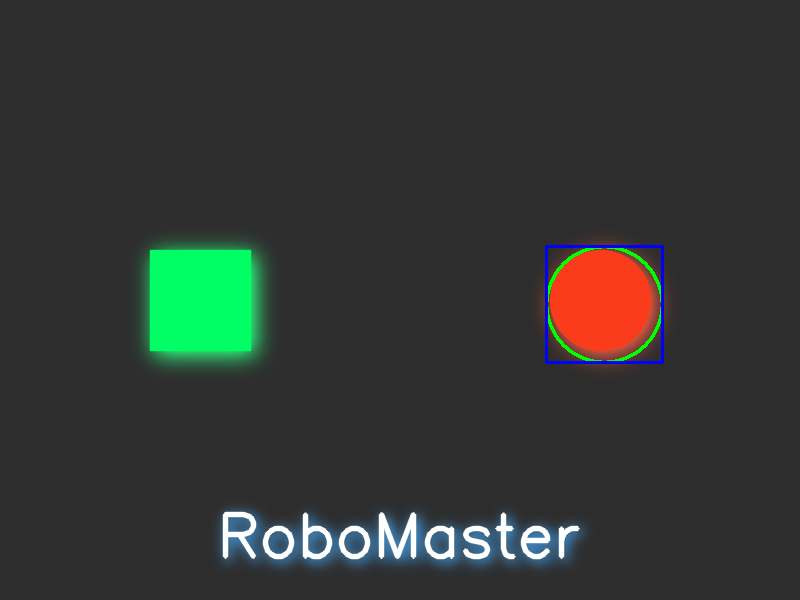

## 任务概述

本次任务是使用 OpenCV 库对给定的图像进行一系列基础图像处理操作，包括颜色空间转换、滤波操作、特征提取、图形绘制和图像变换等。具体要求如下：

- **图像颜色空间转换**
  - 转换为灰度图
  - 转换为 HSV 图像
- **应用各种滤波操作**
  - 应用均值滤波
  - 应用高斯滤波
- **特征提取**
  - 提取红色颜色区域（使用 HSV 方法）
  - 寻找图像中红色的外轮廓
  - 寻找图像中红色的 bounding box
  - 计算轮廓的面积
- **提取高亮颜色区域并进行图形学处理**
  - 灰度化
  - 二值化
  - 膨胀
  - 腐蚀
  - 对处理后的图像进行漫水填充
- **图像绘制**
  - 绘制任意圆形、方形和文字
  - 绘制红色的外轮廓
  - 绘制红色的 bounding box
- **对图像进行处理**
  - 图像旋转 35 度
  - 图像裁剪为原图的左上角 1/4

## 实现思路

### 1. 图像读取与颜色空间转换

- 使用 `cv::imread` 读取图像，检查图像是否成功加载。
- 使用 `cv::cvtColor` 将彩色图像转换为灰度图和 HSV 图像，便于后续处理。

### 2. 滤波操作

- **均值滤波**：使用 `cv::blur` 平滑图像，减弱噪声。
- **高斯滤波**：使用 `cv::GaussianBlur` 更平滑地处理图像，同时保留边缘信息。

### 3. 红色区域提取与轮廓检测

- **提取红色区域**：由于红色在 HSV 空间中分布在两个区域，分别使用 `cv::inRange` 创建两个掩膜，然后使用 `cv::bitwise_or` 合并。
- **轮廓检测**：使用 `cv::findContours` 查找红色区域的轮廓。
- **绘制外轮廓和计算面积**：过滤掉面积过小的噪声轮廓，使用 `cv::drawContours` 绘制，并输出每个轮廓的面积。

### 4. 绘制红色的 Bounding Box

- **获取 Bounding Box**：使用 `cv::boundingRect` 获取每个轮廓的最小外接矩形。
- **筛选 Bounding Box**：为了避免冗余，使用自定义的 `screening` 函数，基于重叠率筛选出有效的矩形框。
- **绘制 Bounding Box**：使用 `cv::rectangle` 绘制最终的矩形框。

### 5. 高亮区域提取与图形学处理

- **灰度化和二值化**：将图像灰度化后，使用 `cv::threshold` 进行二值化，提取高亮区域。
- **形态学操作**：使用 `cv::dilate` 和 `cv::erode` 进行膨胀和腐蚀操作，增强特定特征。
- **漫水填充**：使用 `cv::floodFill` 填充指定的区域。

### 6. 图像绘制

- **绘制基本图形**：在 `painting.cpp` 中，使用 `cv::rectangle` 和 `cv::circle` 绘制矩形和圆形，添加光晕效果。
- **绘制文字**：使用 `cv::putText` 绘制文字，同样添加光晕效果。
- **模拟阴影效果**：通过高斯模糊模拟光晕和阴影。

### 7. 图像旋转与裁剪

- **旋转**：使用 `cv::getRotationMatrix2D` 和 `cv::warpAffine` 对图像旋转 35 度。

- **无损旋转**：通过计算旋转后图像可能需要的最大宽度和高度，并相应调整旋转矩阵的平移量，来实现无损旋转。旋转后的图像尺寸根据角度计算如下：

  - 旋转后图像的宽度： $new\_width = |W \cdot \cos(\theta)| + |H \cdot \sin(\theta)|$
  - 旋转后图像的高度： $new\_height = |W \cdot \sin(\theta)| + |H \cdot \cos(\theta)|$

  然后通过调整旋转矩阵中的平移部分，确保图像内容在旋转后居中，避免被裁剪。

- **裁剪**：使用 `cv::Rect` 定义区域，截取原图的左上角 1/4。

## 任务实现过程和结果

### 主程序（main.cpp）

1. **读取图像并检查有效性**：

   ```cpp
   Mat image = imread("../resources/test_image.png");
   if (image.empty()) {
       cerr << "无法加载图像！" << endl;
       return -1;
   }
   ```

2. **颜色空间转换**：

   - 转换为灰度图：

     ```cpp
     cvtColor(image, gray_image, COLOR_BGR2GRAY);
     ```

   - 转换为 HSV 图像：

     ```cpp
     cvtColor(image, hsv_image, COLOR_BGR2HSV);
     ```

3. **滤波操作**：

   - 均值滤波：

     ```cpp
     blur(image, mean_blur, Size(5, 5));
     ```

   - 高斯滤波：

     ```cpp
     GaussianBlur(image, gaussian_blur, Size(5, 5), 0);
     ```

4. **红色区域提取和轮廓检测**：

   - 创建红色掩膜并合并：

     ```cpp
     inRange(hsv_image, lower_red1, upper_red1, mask1);
     inRange(hsv_image, lower_red2, upper_red2, mask2);
     bitwise_or(mask1, mask2, red_mask);
     ```

   - 轮廓检测：

     ```cpp
     findContours(red_mask, contours, hierarchy, RETR_LIST, CHAIN_APPROX_SIMPLE);
     ```

5. **绘制轮廓和 Bounding Box**：

   - 绘制外轮廓并计算面积，并且过滤面积过小的噪声轮廓：

     ```cpp
     for (size_t i = 0; i < contours.size(); i++) {
         double area = contourArea(contours[i]);
         if (area > 100) {
             cout << "Contour " << count++ << " area: " << area << endl;
             drawContours(contour_image, contours, i, Scalar(0, 255, 0), 2);
         }
     }
     ```

   - 绘制 Bounding Box（调用 `paint_box` 函数）：

     ```cpp
     Mat bounding_box_image = paint_box(image.clone(), 5000, contours, 0.9);
     ```

6. **高亮区域提取和处理**：

   - 二值化（阈值设置为200-255）：

     ```cpp
     threshold(gray_image, binary_image, 200, 255, THRESH_BINARY);
     ```

   - 膨胀和腐蚀：

     ```cpp
     dilate(binary_image, dilated_image, Mat(), Point(-1, -1), 2);
     erode(binary_image, eroded_image, Mat(), Point(-1, -1), 2);
     ```

   - 漫水填充：

     ```cpp
     floodFill(filled_image, mask, Point(500, 500), Scalar(0, 155, 0), 0, Scalar(), Scalar(), 4);
     ```

7. **图像旋转和裁剪**：

   - 旋转 35 度：

     ```cpp
     Mat rotation_matrix = getRotationMatrix2D(center, 35, 1.0);
     warpAffine(image, rotated_image, rotation_matrix, image.size());
     ```

   - 旋转35度（无损）:

     通过三角函数计算旋转后的图像尺寸：
     
     ```cpp
     double radians = 35 * CV_PI / 180.0;
     int new_width = static_cast<int>(image.cols * std::abs(std::cos(radians)) + image.rows * std::abs(std::sin(radians)));
     int new_height = static_cast<int>(image.cols * abs(sin(radians)) + image.rows * abs(cos(radians)));
     ```
     
     调整旋转矩阵中的平移参数，使旋转后的图像居中，避免被裁剪：
     
     ```cpp
     rotation_matrix.at<double>(0, 2) += (new_width - image.cols) / 2.0;
     rotation_matrix.at<double>(1, 2) += (new_height - image.rows) / 2.0;
     ```
     
     ```cpp
     warpAffine(image, rotated_image_lossless, rotation_matrix, Size(new_width, new_height));
     ```
     
   - 裁剪左上角 1/4：
   
     ```cpp
     Rect roi(0, 0, new_width, new_height);
     Mat cropped_image = image(roi);
     ```

### 图形绘制（painting.cpp）

1. **绘制基本图形**：

   - 绘制矩形和圆形并用高斯模糊模拟光晕效果：

     ```cpp
     rectangle(glow_image, ...);
     circle(glow_image, ...);
     GaussianBlur(glow_image, glow, Size(ksize, ksize), 0, 0);
     ```

   - 叠加结果，再次绘制图形，作为图形实体：
   
     ```cpp
     addWeighted(image, 1.0, glow, 1.0, 0, result);
     rectangle(glow_image, ...);
     circle(glow_image, ...);
     ```

2. **绘制文字并添加效果**：

   - 绘制带光晕的文字：

     ```cpp
     putText(textGlow, text, Point(textOrg.x + 3, textOrg.y + 3), ...);
     GaussianBlur(textGlow, textGlowBlurred, Size(41, 41), 0, 0);
     ```

   - 叠加结果并绘制最终文字：

     ```cpp
     addWeighted(result, 1.0, textGlowBlurred, 1.0, 0, result);
     putText(result, text, textOrg, ...);
     ```

3. **红色区域提取和轮廓绘制**：

   - 转换为 HSV 并创建掩膜：

     ```cpp
     cvtColor(result, hsvImage, COLOR_BGR2HSV);
     inRange(hsvImage, Scalar(0, 100, 100), Scalar(10, 255, 255), mask1);
     inRange(hsvImage, Scalar(160, 100, 100), Scalar(180, 255, 255), mask2);
     bitwise_or(mask1, mask2, redMask);
     ```

   - 轮廓检测和绘制：

     ```cpp
     findContours(redMask, contours, hierarchy, RETR_EXTERNAL, CHAIN_APPROX_SIMPLE);
     for (size_t i = 0; i < contours.size(); i++) {
         drawContours(result, contours, (int)i, Scalar(0, 255, 0), 2);
         Rect boundingBox = boundingRect(contours[i]);
         rectangle(result, boundingBox, Scalar(255, 0, 0), 2);
     }
     ```

### Bounding Box 绘制（box_painting.cpp）

- **重叠判断函数**：`almostOverlapped` 用于判断两个矩形的重叠程度。

- **筛选函数**：`screening` 用于筛选出重叠率低于阈值的矩形框，避免冗余。

- **绘制函数**：`paint_box` 接受图像、面积阈值、轮廓和重叠率作为参数，返回绘制了 bounding box 的图像。

## 结果展示

终端运行结果截图：


处理后的图像均已保存至 `../resources/` 目录，包括：

- `gray_image.png`

  

- `hsv_image.png`

  

- `mean_blur.png`

  

- `gaussian_blur.png`

  

- `red_mask.png`

  

- `highlight_regions.png`

  

- `contour_image.png`

  

- `bounding_box_image.png`

  

- `dilated_image.png`

  

- `eroded_image.png`

  

- `filled_image.png`

  

- `rotated_image.png`

  

- `rotated_image_lossless.png`

  

- `cropped_image.png`

  

- `rectangle_circle_text.png`

  

- `rectangle_circle_text_red.png`

  

## 收获

通过本次任务，我熟悉了 OpenCV 中常用的图像处理操作，包括颜色空间转换、滤波、轮廓检测、形态学操作、图形绘制和图像变换等。学会了如何组合使用这些操作来完成复杂的图像处理任务。同时，对图像中目标的提取和处理有了更深入的理解，为后续更高级的图像处理和计算机视觉任务打下了坚实的基础。


## 附

### RM Logo绘制（logo_painting.cpp）

首先使用hough_line直线检测算法检测出RM Logo中的线段并获得端点坐标，然后基于坐标连接绘制直线、半圆形成轮廓，然后提取logo主体的边界轮廓，并在轮廓内，基于像素点横坐标计算渐变颜色并逐像素点上色形成渐变效果。


